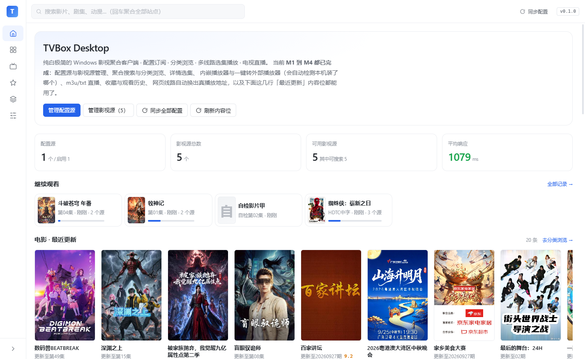

# TVBox Desktop

纯白极简的 Windows 影视聚合客户端。吃安卓 TVBox 的配置订阅格式，用桌面端更好用的交互方式呈现。



| | |
|---|---|
| **技术栈** | Electron 44 + React 19 + TypeScript 7 + Vite 7 + zustand，ArtPlayer + hls.js |
| **形态** | 便携——配置与缓存都在程序同级的 `data\`，不写 C 盘用户目录 |
| **验证** | `npm run selftest` 端到端 **177 项断言**全绿；`npm run typecheck` / `npm run build` 干净 |
| **进度** | M1 → M4 全部完成，另有若干轮用户反馈驱动的修补 |

- 设计文档（功能范围 / JSON 格式规范 / 里程碑）：见 [`功能框架.txt`](功能框架.txt)
- 版本变更与每一轮用户反馈的修补记录：见 [`CHANGELOG.md`](CHANGELOG.md)
- 当前进度：**M1 到 M4 全部完成** —— 配置源管理、影视源管理、聚合搜索、分类浏览、详情选集、ArtPlayer 内嵌播放与一键转外部播放器（自动探测本机装了什么）、网页线路自动换出真播放地址、电视直播（m3u / txt + 线路体检）、首页内容位、收藏与观看历史都可用
- 已用真实公开订阅源跑通全链路：搜索 5/5 站点有响应、详情解析出多线路与剧集、分类浏览归并出 7 个大类（含子分类）、电视直播拉到 14 个分组 541 个频道并能直接放（见 `shots/player.png`、`shots/browse-sub.png`、`shots/live.png`）

---

## 快速开始

```bash
npm install          # 首次安装会自动补下载 Electron 二进制（走 npmmirror）
npm run dev          # 启动开发窗口
```

如果 Electron 二进制没下下来（国内直连 GitHub Releases 会失败），手动执行：

```powershell
$env:ELECTRON_MIRROR="https://npmmirror.com/mirrors/electron/"
node node_modules/electron/install.js
```

## npm 脚本

| 命令 | 作用 |
| --- | --- |
| `npm run dev` | 启动开发窗口（渲染进程热更新） |
| `npm run dev:debug` | 同上，另外打开 CDP 调试端口 9222 |
| `npm run selftest` | 端到端自检：起本地桩服务器 + 驱动窗口，177 项断言 |
| `npm run typecheck` | 主进程与渲染进程双工程类型检查 |
| `npm run build` | 产出 `out/`（主进程 / preload / 渲染进程） |
| `npm run build:win` | electron-builder 打包出 NSIS 安装包与免安装 zip |

## 目录结构

```
src/
  shared/            主进程与渲染进程共用
    types.ts           Site / Vod / VodDetail / AppSettings ...
    ipc.ts             IPC 通道常量
    siteLabels.ts      站点类型的中文名与色签
  main/              主进程
    index.ts           窗口创建、生命周期、IPC 处理器注册
    services/
      store.ts         JSON 落盘（内存缓存 + 防抖 + 临时文件改名）
      http.ts          统一网络层（UA / 超时 / GBK 自动解码 / header 通配规则）
      cms.ts           苹果CMS 地址构造与返回判定
      config.ts        配置 JSON 归一化（A 方言与 B 方言都能吃）
      sources.ts       配置源增删改查、同步、启动回填
      sites.ts         影视源汇总去重、本地覆盖、连通性测试
      settings.ts      应用设置
      presets.ts       内置推荐订阅（配置内容随程序走，不依赖仓库里的 samples/）
      search.ts        聚合搜索（并发池 + 流式进度 + 可取消）
      category.ts      分类浏览（拉各站 ac=list 分类树 → 按祖先链归并大类/子分类 → 按叶子 id 逐页拉）
      detail.ts        详情与选集解析（CMS / 网页规则两条路）
      htmlRules.ts     网页规则取值语法（选择器 || 属性 && 提取）
      player.ts        外部播放器探测与唤起（扫常见安装路径 + 问注册表里的默认打开方式）
      live.ts          直播源解析（m3u / txt 两套语法 → 按频道名合并成一卡多线路）
      liveHealth.ts    直播线路体检（只读 4KB 判活 + 抓最高档画质；成功缓存 30 分钟 / 失败 5 分钟）
      streamResolve.ts 房间号频道换真地址（huya:// / douyin:// → 带防盗链的 m3u8）
      proxy.ts         启动时探一次系统代理，端口连不上就改为直连（见下）
      library.ts       收藏与观看历史（json 落盘，历史最多留 200 条；按归一化片名把多源合并成一条）
      ai.ts            AI 剧情总结（文字 / 看片两条路，Key 不出主进程）
      parse.ts         解析接口（直链放行 → 自己读播放页 → 按排行问接口）
      home.ts          首页内容位（读配置里的 home.sections，没配就每个可用源一条「最近更新」）
  preload/           contextBridge 暴露 window.api
  renderer/          React 界面
    src/pages/         Home / Search / Detail / Player / Live / Library / Sites / Settings
                       （Search 一个组件两种模式：带 ?wd= 是聚合搜索，不带是分类浏览）
    src/components/    Icon / Switch / EmptyState / Toasts / Roadmap / Sidebar / TopBar / AiSummary / VodCard
    src/styles/        tokens.css（设计变量）+ global.css + pages.css
    src/utils/media.ts 直链判定与「默认选哪条线路」
    src/utils/frames.ts 从正在播的 <video> 上按时间点抽帧（canvas + MSE blob，不会跨域）
    src/utils/normalize.ts 片名归一化、别名括号剥离、解说识别、候选打分
    src/store/useApp.ts 全局状态；mergeResults() 同名合并、findSourceGroup() 换源分组
samples/
  demo-config.json     示例订阅（B 方言，含各种站点类型）
  public-sources.json  实测存活的公开采集站（与内置推荐订阅内容一致）
  selftest-config.json 自检用配置（全部指向本地桩服务器）
shots/                 界面截图（firstrun / home / browse / sites / settings / settings-parse / settings-player / search / detail / player / library / library-history / live）
scripts/
  ensure-electron.cjs  postinstall 时补下载 Electron
  selftest.mjs         端到端自检
  stub-server.mjs      本地桩服务器（苹果CMS + 网页规则站 + 假 m3u8 + 占位海报）
  eval.mjs             往运行中的窗口丢一段 JS 执行
  shot.mjs             按 CDP 截图到 shots/
  probe-apis.mjs       批量探活候选采集接口（判断标准：列表有数据 + 搜索有结果）
  apply-sources.mjs    把一份本地配置推进运行中的窗口，并跑连通性 / 搜索 / 详情全链路
  candidates.txt       探活用的候选清单（每行「名字 地址」）
  candidates3.txt      同上，第二批
```

## 配置 JSON 怎么写

两种方言都能吃，扩展字段统一放在 `tvboxDesktop` 键下，对安卓 TVBox 无副作用。

**A 方言**：直接填现成的 TVBox 订阅地址，原样解析。

**B 方言**（手写推荐）：

```json
{
  "format": "tvbox-desktop/1",
  "name": "我的订阅",
  "sites": [
    {
      "key": "example_cms",
      "name": "示例站",
      "type": "cms",
      "api": "https://example.com/api.php/provide/vod",
      "searchable": 1
    }
  ],
  "lives": [{ "name": "直播源", "url": "https://example.com/live.txt" }],
  "parses": [{ "name": "解析", "type": 1, "url": "https://example.com/jx?url=" }],
  "headers": [{ "host": "*.example.com", "header": { "User-Agent": "okhttp/3.12.0" } }],
  "tvboxDesktop": {
    "home": {
      "sections": [
        { "title": "电影 · 最近更新", "site": "example_cms" },
        { "title": "电影 · 动作片", "site": "示例站", "typeId": 6 }
      ]
    }
  }
}
```

站点 `type` 可以是数字或字符串：

| 值 | 含义 | 桌面端 |
| --- | --- | --- |
| `3` / `"cms"` | 苹果CMS（主力）；`api` 可写基地址，也可写带 `{ac}{wd}{pg}{t}{ids}` 占位符的模板 | ✅ 搜索 + 分类浏览 |
| `1` / `"html"` | 网页规则站，靠 `rules` 里的 CSS 选择器抓取 | ✅ 仅搜索 |
| `4` / `"api"` | CMS 变体 | ✅ 搜索 + 分类浏览 |
| `0` / `"spider"` | 需要配套 jar/dex，桌面端跑不了 | ❌ 会灰显并说明原因 |
| `2` / 其它 | 未知类型 | ❌ 会灰显并说明原因 |

站点级可选字段：`searchable`、`quickSearch`、`filterable`、`categories`、`header`、`timeout`、`enabled`。

## 内置推荐订阅

首启页和设置页会列出「公开可用源（苹果CMS 采集站）」，**默认不启用**——点一下「添加」才会写进你的配置源。

添加时配置内容会落到 `data\presets\public-cms.json`，而不是引用仓库里的 `samples/`，所以仓库删掉、换台机器都能继续用。

里面是目前实测存活的 5 个公开采集接口（非凡 / 量子 / 电影天堂 / 光速 / 素博）。这类站点随时可能失效，失效后在「影视源」页点「测试」就能看出来，删掉或关掉即可。想自己再找一批，用 `node scripts/probe-apis.mjs` 探活。

## 自检

```bash
# 终端 A
npm run dev:debug
# 终端 B
npm run selftest
```

自检会验证十三块共 177 项断言：六个路由渲染、配置解析、站点类型归一化、CMS 与网页规则站的连通性测试（含失败路径）、自定义请求头透传、界面渲染、搜索 → 详情 → 选集 → 播放器全链路（含同名合并、解说过滤、详情页选片源、播放页换片源与可点地址框）、分类浏览（大类 → 子分类归并、记录片/短剧/动画片的归位、伦理片整棵子树被丢掉、叶子 id 展开、滚到底接上下一页、翻页后开头几张卡的位置不变）、电视直播（m3u 与 txt 两种格式、跨源同名合并成多线路、内置自定义频道始终在、分组名去装饰符、房间号必须是纯数字、线路体检按地址记结果、能拉起来的标成可用、404 的标成不可用并写清原因、体检结果会落盘、整组都是死链的频道默认被藏起来、顶部给出「显示 N 个不可用」开关、点开后能看到被藏起来的频道并标成不可用、清空体检表）、收藏与观看历史（含同一部剧在两个源上合并成一条、行上给出可切换的源）、AI 剧情总结（区块位置、「点了才开始」文案、主动作是看片而不是纯文本推断、按有没有 Key 分支断言按钮状态与抽帧提示）、解析接口（配置里带的会出现在列表里、直链原样返回不白跑、分享页里的地址自己读得出来、兜底时会往下轮询而不是只问一条、只剩坏接口时如实报失败且坏接口确实被问过、失败过的沉到后面下次直接用成功过的、战绩分开记不互相污染、跑完不留自检用的接口）、首页内容位（走的是 `tvboxDesktop.home.sections` 这个命名空间、按 key 与按中文名都找得到源、指定分类就按分类拉、写错的源只让那一行报错）、外部播放器（检测返回的数组形状、不认的协议被挡在解析之前、设置页的检测按钮点了会出结果），以及页面无 JS 异常。

> `[9/13]` 段要把收藏与历史清干净才对得上数目，所以脚本**开头先备份、末尾再还原**你真实的收藏与观看记录。内容和排序都保住，但 `updatedAt` 会被刷新（`recordHistory` 一定会盖 `Date.now()`），因此还原后这些记录都显示「刚刚」。

> 自检**刻意不真的调 DeepSeek**：不该花使用者的钱，也不该依赖外网。它只按设置里有没有 Key 分开断言界面该有的样子。

> 直播页有个容易踩的坑：渲染进程**不能**自己缓存直播结果。早先写成「内存里有就直接返回」，而主进程那份缓存是换配置源时主动作废的，结果同步完新订阅再进电视直播，看到的还是上一个源的分组，只有重启才好。现在每次进页面都问一次主进程，缓存还新鲜时就是一个来回的 IPC。同一个源的失败提示只会弹一次。

自检开始时会先 `Page.reload` 一次：编辑代码中途保存可能给 Vite 留下一次失败的 HMR 报错，它会一直挂在页面 console 里，被「没有 JS 异常」断言误当成新错误。滚动加载这类依赖渲染帧的断言还要求页面处于可见 + 聚焦状态（`Page.bringToFront` + `Emulation.setFocusEmulationEnabled`），否则 Chromium 会把 rAF 和 IntersectionObserver 完全节流，测出来永远是「没反应」。

## 电视直播

直播源支持 m3u 与 txt 两套语法，同一频道的多个来源会合并成一张卡、一张卡上多个线路。当前内置源实测拿到 **14 个分组 541 个频道**（见 `shots/live.png`）。

真正的问题不是源少，而是**死链多**：把候选公开源挨个量过一遍之后，现有那批地址里约 27% 拉不起来，约 32% 的频道一条能播的线路都没有。加源没用——`zbds-iptv4.m3u` 是现有 txt 的严格子集（542 条完全相同、独有 0 条），`fanmingming/live/index.m3u` 抽样 0% 可播，`iptv-org` 的 `cn.m3u` 抽样 23%，Gather.m3u 只有 13%。所以做法是**把已有的线路用起来**，而不是继续堆源：

- **进分组后后台预热**：把当前分组前 60 条可探地址交给主进程，每次最多 8 条并发、**只读到 4 KB 就断开**（直播流不会结束，绝不能整条拉完），顺带从 m3u8 头里取 `BANDWIDTH` / `RESOLUTION` 记下最高一档画质。成功缓存 30 分钟、失败只缓存 5 分钟——失败短一点，免得上游抖动一次就被记很久。
- **点开频道时优先用探到的线路**：有已知可用的就直接用；没有就先体检再挑一条。**播放中途拉流失败会自动换到下一条**，并提示「这条线路拉不起来，已自动换到第 N / M 条」。
- **默认藏掉整组都探不到的频道**，顶部给一个「显示 N 个不可用」开关。频道卡上标 `2/2 线`，不可用的那张打虚线并写「不可用」。
- 右上角「体检线路」= 清空体检表重测一遍。

体检请求会带上配置里配的请求头（和搜索、详情走同一套 `resolveHeader`）：不少直播网关校验 Referer/UA，不带的话会把好线路一律误判成 403。

画质上，起播直接选**最高档**（在 `MANIFEST_PARSED` 里设 `hls.nextLevel`，不是 `currentLevel`——后者会把 ABR 关掉钉死），之后仍然允许 ABR 自适应降档；`abrEwmaDefaultEstimate` 提到 4 Mbps，避免一上来就从 500 kbps 估起。

> 内置的「公开直播源·Gather（m3u）」已经去掉了：123 条地址实测 108 条拉不起来，而且和 IPv4 那条源**一个重名频道都没有**，合并后只是白白多出一堆死链。现在内置只留 IPv4（txt）那一条。

## 房间号频道（`huya://` / `douyin://`）

虎牙、抖音这类平台的直播地址**带防盗链签名、几小时就失效**，写进直播源里第二天就是死链。所以直播源里只写房间号：

```
游戏赛事,#genre#
danking直播,huya://10188
```

地址栏里 `huya://10188` 是「虎牙房间 10188」，`douyin://<web_rid>` 是抖音直播间。只有**用户点开这个频道**时才去平台换真地址（走的是一次 IPC，不是页面里直接请求），换好了才构造播放器。

点开时如果主播没开播，播放区会显示「换不到播放地址」+ 具体原因 + 重试按钮，而不是黑屏。

三个必须记住的坑：

- **虎牙 TX / AL 两条线给的是「主播放列表」**，里面那条变体地址被改写成 `http://<边缘节点IP>/tx.hls.huya.com/src/…` —— 浏览器带着 `Host: <IP>` 去拉**一律 403**（还原主机名、补 `Origin`、补 `Referer` 全试过，还是 403）。而 **HS 那条直接给「媒体播放列表」**，分片是相对路径，实测 200 + `video/MP2T`。所以解析器会逐个探测，**优先挑含 `#EXTINF` 的真媒体列表**，主列表只当兜底。
- **`Referer` 是浏览器的 forbidden header**。`xhr.setRequestHeader('Referer', …)` 会被**静默忽略**——hls.js 实际发出去的是页面自己的来源（开发时 `http://localhost:5173/`），CDN 因此对分片回 403，而播放器**不报任何错**：`readyState` 停在 0、`video.error` 恒为 `null`，只表现为黑屏。修法是在会话层补：主进程用 `session.defaultSession.webRequest.onBeforeSendHeaders` 给匹配的请求写上头。匹配只按**域名后缀**，因为虎牙把真实主机名塞进了 path，按 host 匹配会漏。
- **抖音的取流接口不要签名**（先进 `https://live.douyin.com/` 拿 `ttwid`，再调 `webcast/room/web/enter/`），但它的**分区 / 用户列表接口全返 444 `Access Denied`（要 `a_bogus` 签名）**，首页和用户主页又是客户端渲染、没有 SSR 的 `web_rid`。所以**没法自动发现某人的抖音直播间号**，只能由用户提供。

## 分类浏览

左侧导航第二项。**没有搜索框**——找片名用顶部的全局搜索框，这一页是「不知道看什么」时用的目录。

打开时向每个可搜索的 CMS 站点拉一次 `ac=list`，拿到各自的分类树后归并成统一的**大类**（电影 / 电视剧 / 动漫 / 综艺 / 纪录片 / 短剧 / 体育 / 少儿）。点进大类后，上方会出现一排**子分类**标签（电影 → 全部 / 动作 / 喜剧 / 爱情 / 科幻…，电视剧 → 全部 / 国产 / 香港 / 韩国…），标签上的数字是覆盖到几个站点。分类结果缓存 10 分钟。

归并是**对着整条祖先链**做的，不是只看顶层，因为真实站点会把类型混着挂：

- `记录片` 挂在「电影片」下面，而且写的是「记录」不是「纪录」——漏了这个字它就会留在电影里；
- `短剧` 挂在「连续剧」下面，要拆出来归到短剧；
- `动画片` 归哪儿要看父分类：挂在「动漫片」下面归动漫，挂在「电影片」下面则是动画电影，要跟着父分类归到 电影 → 动画（光速/素博的同类叫「动漫电影」，不这么处理同一类内容会裂成两个区）。这条例外精确列在 `category.ts` 的 `LEAF_FOLLOWS_PARENT` 里，只对祖先链匹配，不影响别的站点；
- `伦理片` 在非凡/量子/天堂是**子分类**（在光速/素博是顶层）。只挡顶层名字的话这三个站的伦理片会漏进电影里，所以 `SKIP` 规则沿祖先链生效，命中就整棵子树丢掉。

尺度过大的过滤**只按分类名挡**（伦理 / 福利 / 写真 等），不做片名关键词兜底，而且**只在分类浏览里生效**，聚合搜索不受影响。

往下滚到底会**自动加载下一页**：底部有个哨兵元素，用 `IntersectionObserver`（提前 500px）判断是否进入视口。翻页状态在底部有回显（「向下滚动自动加载 · 第 N / M 页」）；失败时停下来显示原因和「重试」，不会一直重试把站点打爆。

首屏一画完，应用就在后台**把下一页先拉好**（`useApp.ts` 里的 `startBrowsePrefetch` / `takeBrowsePrefetch`）。滚到底时如果那份已经到手就直接换上，实测一页从冷拉的约 3.8 秒变成 **307 毫秒**。预取失败不弹提示——真滚到那儿时会自然重试一次，没必要提前吓用户一跳。

翻页时**已经上屏的卡片不会被重排**。合并结果默认按「这条有几个源」排序，新一页里和前面同名的条目会并进已有的组、把那个组的源数抬高，整块就跳到最前面——现象正是「一加载下一页，前面全部刷新了一遍」。修法是 `mergeResults()` 多收一个 `previousOrder`（上一轮的名次表），排完序再把「之前出现过的」按原名次放回去、新出现的接在后面（只有分类浏览翻页传这个参数；搜索结果那边本来就希望好结果往上浮）。这里有个坑：名次表在回到第 1 页时必须**整个重建**，只追加的话同一个分类再点一次会沿用上一轮跑到第 20 页留下的名次。

从分类页点一张卡进详情页时，页面**先把已经拿得到的东西显示出来**——片名、海报、评分、备注都来自结果列表里那份数据，线路和剧集在后面加载，期间用骨架占位。实测冷卡片 `#/detail/lzi/152870` 在 **+40ms** 就有真片名与真海报，**+320ms** 换成完整内容；修之前 +60ms 还是空标题加骨架。详情页找「已知信息」和「还有几个源」时会同时看搜索结果与分类浏览结果（`crossResults`），所以从分类页进来的卡片也能看到换源入口。

三个踩过的坑写在 `src/main/services/category.ts` 和 `cms.ts` 里：

- **父分类 id 查不出东西**（实测 `t=1` 返回 0 条），必须展开成叶子分类。
- **重复的 `t` 参数是「最后一个生效」而不是 OR**：实测 `t=6&t=7` 的 total 等于 `t=7` 的 total、返回的也全是喜剧片，`t=6,7` 则只认第一个。所以「全部」是**每个叶子各发一次请求**再由应用交替合并（不是首尾相接，否则第一屏全是同一类型），而不是把多个叶子塞进一次请求。
- **页数要读接口自己报的 `pagecount`**：采集站每页固定 20 条，和请求里的 `limit` 不一致，按「本页满没满」猜会永远算出 1 页。

各站的分类名和 id 都不一样（同一部电影在非凡资源是 `动作片#6`，在素博资源是另一个 id），所以大类只是「归并展示」用的桶，实际请求仍按每个站点自己的叶子 id 发。

> 分类目录和直播一样，**渲染进程不能自己长期存一份**。早先渲染进程只在 `categories` 为空时拉一次，主进程那份 10 分钟缓存又是按站点 key 存的；换订阅时 key 变了能自然失效，但**原地改源地址 / 禁用某个站点**时 key 没变，两边都还认旧目录——现象是子分类条只显示几个子分类、数字还是上一套源的。现在站点集合一变就清掉渲染进程的 `categories`（`staleCatalog()`），主进程侧也在 add / update / remove / sync / syncAll 里主动 `clearCategoryCache()`。

「全部」要把每个子分类逐个查一遍（电影就有 8 个叶子 × 5 个站点 = 40 个请求，实测 4–8 秒），所以点进多子分类的大类时**默认落在第一个子分类**上，想全看再点「全部」。

## 收藏与观看历史

「收藏与历史」页分两栏，历史每条记下看到第几集、看到哪个时间点、以及是哪个源。

- **同一部剧在多个源上看过只算一条。** 分组发生在读取时（`history.json` 里存的仍然是「一个源一条」），按**归一化片名**归并：全角转半角、统一小写、去掉空格与标点。所以素博的「斗破苍穹 年番」和电影天堂的「斗破苍穹年番」会合成同一条（两个真实源实测就是这样合上的）。
- 归一化**刻意保守**：不去剥「第二季」「(国语)」这类后缀。宁可漏合（「庆余年」和「庆余年 第二季」算两条），也不要把不同季的进度串到一起。
- 一条里收着多个源时，行上会出现「N 个源」和几个可点的源标签：**主记录是最近看过的那一条**，点别的源就切过去，「继续观看」跟着跳到那个源的那一集。
- 进度条只在**知道时长**时才画，右侧同时给出 `看到 9:23 / 23:07`。时长未知（直播，或者打开后没等出时长就退出）时不画，而不是画一条 0% 的灰线——满宽的灰底配上 1% 的蓝点会被看成一条分隔线。
- 删除按钮删的是**这部片在所有源上的记录**，有多个源时会先确认一次。

### 一个已经修掉的坑：进度被 0/0 覆盖

播放页**挂载的瞬间**就会先写一条观看记录（这样一进片它就出现在历史里）。但那一刻 `video.duration` 还是 `NaN`，写进去的是 `position: 0 / duration: 0`。以前 `recordHistory()` 是无条件覆盖，于是：

- 打开一部片、没等加载出来就退出 → 这条永远是没有进度条的「秃行」；
- 在播放页上按 `Ctrl+R`、或者应用恢复到播放路由 → 挂载那一条会把**已经看到 41% 的进度直接抹成 0/0**（实测 `565/1387` → `0/0`）。

现在 `recordHistory()` 加了合并规则：**同一集时，只有这次真的拿到了时长（`duration > 0`）才允许改写进度，否则沿用上一次记下的值。** 用「同一集」当条件，是因为换到别的集时 0/0 是诚实的——新的这一集确实还没开始看。

`src/renderer/src/utils/format.ts` 里的 `watchPercent()` 和 `formatClock()` 由历史页与首页「继续观看」共用。

## 首页内容位

首页在「继续观看」下面会铺几行横排海报，每行一个板块。**数据来自配置里的 `tvboxDesktop.home.sections`**：

```json
"tvboxDesktop": {
  "home": {
    "sections": [
      { "title": "电影 · 最近更新", "site": "dyttzy" },
      { "title": "电影 · 动作片", "site": "ffzy", "typeId": 6 }
    ]
  }
}
```

- `site` 既可以是站点 key，也可以写站点中文名（匹配顺序：key 精确 → 中文名精确 → 忽略大小写 → 互相包含）。用户手写配置时很难记得住 key，所以多给了后面三级。
- **写了 `typeId` 就是「分类推荐」**，走分类浏览的地址；不写就是该源的「最近更新」。
- **没配就每个可用源给一条**：每行标题是「<源名> · 最近更新」，行尾会打一个 `自动` 标签，一眼能看出这行不是你自己排的。
- **一行拉不到不影响别人**：某一条写错了源、或者那一下网络抖动，只会让**那一行**显示一行错误文字（比如「配置里写的影视源『X』不在当前已启用的源里」），其余照常画。

内置的「公开可用源」订阅里已经带了 5 条，所以开箱就是这个样子（都在真实源上逐条验证过 20 条有内容）：

| 行标题 | 来源 | 类型 |
| --- | --- | --- |
| 电影 · 最近更新 | 电影天堂资源 | 最近更新 |
| 电影 · 动作片 | 非凡资源（`typeId: 6`） | 分类推荐 |
| 电视剧 · 国产剧 | 量子资源（`typeId: 13`） | 分类推荐 |
| 动漫 · 日本 | 光速资源（`typeId: 42`） | 分类推荐 |
| 综艺 · 最近更新 | 素博资源 | 最近更新 |

`typeId` 用的是苹果CMS v10 的默认分类 id，各家采集站基本一致（可以在「分类浏览」页的地址栏里反查，或者直接翻接口返回的 `class` 列表）。

渲染进程**不自己缓存**：结果在主进程里按配置源签名缓存 10 分钟，**失败的那些只缓存 1 分钟** —— 实测素博偶尔会抖一下 `fetch failed`，按 10 分钟缓存会让用户盯着一行错误看很久。hero 上的「刷新内容位」按钮是强制重拉。

## AI 剧情总结

播放页视频地址下面有一块「AI 剧情总结」，**点了才会请求**，不会在你进片的时候偷偷花钱。两个按钮：

- **看一遍再总结**（默认）：先把正在播的这一集用 canvas 按每 20 秒抽一帧过一遍（45 分钟一集约 130 帧，抓的时候会把整集缓冲一遍，约 1 分钟），把几十张画面连同剧集资料一起交给 `deepseek-flash`。它是多模态模型，所以写的是画面里**实际发生的事**：会读画面上的硬字幕并照实引用（实测抓到「这薛崩可是九星斗师」「我知道你并非萧家之人」这类台词），并给出带时间点的「剧情节点」。一集 70 帧约 1.5 万 tokens、4 秒左右，成本约两分钱。
- **只看资料**：不抽帧，只把文本资料发给模型，让它依据自己的剧集知识写。快、便宜，但对新剧和冷门剧基本是瞎猜。

其他：

- Key 存在本机 `data/settings.json`，**只在主进程里用**（`src/main/services/ai.ts`），渲染进程拿不到，也不会随请求外传。
- 发给 DeepSeek 的是：片名、类型、年份、地区、导演、演员、评分、备注、站点简介（截前 1200 字）、当前在看第几集，以及（看片模式）抽出来的 JPEG 画面。**播放地址不会发**。
- 默认模型 `deepseek-flash`，非思考模式（请求体里带 `thinking: { type: 'disabled' }`）。看片模式**只能用 `deepseek-flash`**——官方的 `deepseek-v4-pro` 不收图。
- 抽帧走的是 MSE：ArtPlayer 用 hls.js 播 m3u8，`<video>.src` 是 `blob:`，属于同源，所以 `drawImage` 到 canvas 之后 `toDataURL()` 不会被跨域防护拦住（直接给 `<video src="http://别的域/x.m3u8">` 就会）。
- 结果可以「复制 / 重新看一遍 / 收起」，换集会重建组件，不会把上一集的总结留在屏幕上。

设置页「AI 总结」里填 Key（在 platform.deepseek.com 的 [API keys] 创建）。接口地址留空即官方 `https://api.deepseek.com`，换成任何 OpenAI 兼容服务也可以，程序会自动拼 `/chat/completions`。

> **看片模式最大的短板是没有声音**：抓到的帧里没有音轨，所以带硬字幕的片模型读得准，不带字幕的片只能描述画面在演什么、听不懂对白。提示词里写死了这一点，并要求「不要编造对白、人物姓名，或画面上看不到的情节」——实测它会主动写「仅凭现有资料无法确定本集的具体情节」。把它当成看片前的引子可以，当成剧情考据不行。
>
> 另外抽帧会为了跳时间点而把整集下载一遍，源站限流时个别时间点可能跳不过去（代码里跳过失败帧继续，不会中断整次扫描）。

## 系统代理

界面里的海报和视频走 Chromium，而主进程的请求走 Node —— **两者对系统代理的处理不一样**：Chromium 会老老实实听 Windows 的代理设置，Node 的 `fetch` 根本不读它。

所以当 Windows 的系统代理开着、指向的代理软件却没在跑时（Clash 之类的内核退了，`ProxyEnable` 还留在 1），会出现一种很像播放器坏了的现象：

- 搜索、详情、分类、直播分组**全都正常**（走主进程）；
- 但界面里**所有**图片和视频都黑，控制台一片 `net::ERR_PROXY_CONNECTION_FAILED`。

`src/main/services/proxy.ts` 在启动时（建窗口之前）处理这件事：用 `resolveProxy` 问出系统代理链，对里面每个 `host:port` 做一次 800ms 的 TCP 探测，**只要有一个在监听就照旧走系统代理**，一个都连不上才把这次会话切成 `direct://` 并打一条 `[proxy] ...` 警告。代理真在跑时行为完全不变。注意这个判断每次启动只做一次 —— 启动时代理是死的、之后你又把代理打开了，需要重启应用才会用上。

## 开发辅助脚本

```bash
node scripts/stub-server.mjs      # 起本地桩服务器（127.0.0.1:8899），手动点界面时很有用
node scripts/eval.mjs "#/sites" "document.title"   # 往运行中的窗口丢一段 JS
node scripts/shot.mjs home detail player --wd=自检  # 按 CDP 截图到 shots/
node scripts/shot.mjs search detail player --site=lzi --id=88770 --line=1   # 截真实源的页面
node scripts/probe-apis.mjs       # 重新探活候选采集接口（默认读 scripts/candidates*.txt）
node scripts/apply-sources.mjs samples/public-sources.json 庆余年   # 推进配置并跑全链路验证
```

前四个需要 `npm run dev:debug` 已经在跑（走 CDP 端口 9222）。

## 数据目录

配置、站点覆盖、设置以及浏览器缓存都放在**程序同级的 `data\` 目录**，不写 C 盘用户目录：

| 场景 | 位置 |
| --- | --- |
| 开发 | `D:\tvbox\data\` |
| 打包后 | `<exe 所在目录>\data\` |
| 浏览器缓存 | `data\session\` |

```
data/
  settings.json    应用设置
  sources.json     配置源
  sites.json       站点本地覆盖
  session/         Chromium 缓存
```

如果这个位置建不出来（比如装到了只读目录），会自动退回系统默认的 `%APPDATA%\tvbox-desktop\` 并在控制台提示。第一次切过来时会把旧目录里已有的 `settings/sources/sites.json` 拷过来，配置不会丢。

## 结果合并与换源

- **同名合并**：搜索结果先按归一化片名分组，不同站点上的同一部影片合成一张卡，卡片上的「N 个源」标签鼠标悬停能看到具体是哪些站点。
- **一个站点只留一条**：同一站点对同一部剧经常返回好几条（不同清晰度/语种），合并前会按「有海报 > 有备注 > 有评分，同分取名字短的」每站只保留最有信息量的一条，所以卡片不会顶着「庆余年第二季粤语」这种后缀。
- **别名括号会去掉**：`庆余年，全世界都以为我是废物太子（庆余年之大凉太子爷）` 会和 `庆余年，全世界都以为我是废物太子` 合成一条。但括号里是分季分集信息时（`第61-81集`、`特别篇`）会保留，避免把第一季和第二季合并。
- **详情页选片源**：详情页有独立的「选择片源」区块，列出这部片子在每个站点上的条目（当前这条标「正在看」），点「切换」就换到这个源，选集进度会重新加载。片名与当前不同的会显示「该源片名：…」，方便分辨。
- **过滤解说**：默认隐藏解说类二创内容，搜索页副标题会写明挡掉了多少条。搜索页的「过滤解说」按钮和设置里的「搜索结果过滤解说」开关都能改。判定用两条线索：片名里带「解说 / 速看 / 盘点 / 混剪 / 拆解 / 影评 / 剧情介绍 / 一口气看完 / 分钟看完」，**或者**分类字段（`vod_class` / `type_name`）是「影视解说」。只按片名判断会漏掉那些片名干净、靠分类标记的条目。网页规则站拿不到分类字段，所以那条路只能按片名判断。

## 换源与外部播放器

- **自动挑能播的那条线路**：采集站经常把网页分享地址放在第 1 条线路、真正的 m3u8 放在第 2 条（量子资源就是 `liangzi` = 分享页、`lzm3u8` = 真直链）。详情页会用 `pickPlayableLine()` 默认选中第一条看起来是直链的线路，「立即播放」也跟着走；已经在放但线路不对时，播放页会给出「换到某线路试试」的入口。
- **没有直链线路时就现场解析**：如果这条线路给的是网页地址，播放器不会直接把网页丢进去，而是先让主进程按上面「解析接口」那三步换出真地址，换的过程中播放器上盖一层「正在换播放地址…」，换完在播放器下面写明是**靠哪条路**换出来的（「直接从播放页里取」还是某条解析接口，以及耗时）。万一所有线路都是网页地址且解析失败，错误会连每条路子的失败原因一起列出来。
- **播放页直接换片源**：播放页侧栏顶部有「片源」区块，列出这部片子在各个站点的条目（当前这条打勾高亮），点一下就换过去继续看。从别的源切过去时链接只带 `/0/0`，播放页会自动跳到该源里能直接播的那条线路。没走过搜索就直接打开播放页（比如刷新后）时列表是空的，点「找其它片源」会按片名现搜一次。
- **播放地址是个可点的小方框**：播放器下方的地址整块可点，点了用系统默认浏览器打开这个地址；想直接拷走用右边的「复制地址」。
- 内嵌播放器是 ArtPlayer + hls.js。浏览器放不了的格式，点「外部播放器」就会唤起本机 PotPlayer / mpv / VLC。
- **设置页能一键检测本机播放器**：点「检测本机播放器」会扫一遍 PotPlayer / mpv / VLC / MPC-HC / MPC-BE / KMPlayer / SMPlayer 的常见安装路径（含 `PATH`），还会问一下注册表里 `.mkv` / `.mp4` / `.ts` / `.flv` 的默认打开方式——绿色版或者装在奇怪目录里的播放器扫不到，但多半被设成了系统默认。结果里每条都带一个「用这个」按钮，点一下就把路径填进上面的输入框；已经生效的那条直接打「已选」。浏览器（Edge / Chrome / 夸克这类）会被过滤掉，不会出现在列表里。
- 手动填的那条**一定会出现在检测结果里**（标「设置里指定的」），否则会出现「一个都没找到」但上面明明配着一个能用的播放器这种别扭局面。留空时按 PotPlayer → mpv → VLC 的顺序自动找。
- 参数模板里 `{url}` 是播放地址、`{title}` 是片名，多个参数用空格分隔，例如 `--fullscreen {url}`。

## 解析接口

采集站的线路经常给的不是直链，而是一个**分享页地址**（素博的 `subyun` 线路就是 `https://play.xluuss.com/play/nelOoxJd`）。这种地址丢给播放器只会黑屏。播放时会走三步：

1. **本来就是直链就直接放**。只看协议和扩展名（`m3u8 / mp4 / flv / mkv / ts / mpd…`），**不做域名白名单** —— 采集站的 CDN 域名天天换，白名单只会误伤。
2. **先自己读一遍那个页面**。十有八九是个 DPlayer 壳，地址明文写在 `const vid = '…/index.m3u8'` 里，抓出来就完事。实测素博的分享页 1.2–2.4 秒换出地址，界面上标「直接从播放页里取」。
3. **读不出来才按排行问解析接口**。排行按「分档 → 战绩」来：声明了匹配线路的优先，其次通配，最后才是声明了别的线路的；同一档里按成功率（拉普拉斯平滑）和速度排。失败的会沉下去，越用越准。

**没有内置任何第三方公开解析接口。** 一方面是合规，另一方面是实测它们大多已经不能用了：要么直接 403/超时，要么回一个 meta refresh 跳走，真正的地址由 `wasm_exec.js` 在前端现算。要不要加、加哪条，由你自己在设置页决定。

| 来源 | 说明 |
| --- | --- |
| **配置里带的** | 订阅 JSON 里的 `parses` 数组，同步配置源后自动出现，不可单独删除 |
| **手动添加** | 设置页「解析接口」区块里加的，落盘在 `data\parses.json`，可删 |

设置页那一块能逐条「测一下」（用腾讯剧集页当靶子）、「逐个测一遍」、看战绩、清空排行。`type=0`（需要浏览器嗅探的那种）会打上警示标签 —— 这种接口靠前端 JS 算地址，HTTP 解析拿不到，目前只支持 `type=1/2` 的 HTTP 解析。

播放时如果换地址失败，播放器上会直接写出**每一条路子分别为什么失败**（「没有拿到可识别的播放地址」「跟着跳转找了几跳，还是没拿到」…），不会假装成功。腾讯那种纯 JS 播放器就是诚实地报失败。

## 已知限制

- 只支持桌面端能跑的站点类型：苹果CMS（type 3/4）与网页规则站（type 1）。安卓那套需要 jar/dex 的 spider（type 0）跑不了，会灰显并写明原因。
- 解析接口只做 HTTP 解析（`type=1/2`）。`type=0` 的浏览器嗅探还没做。
- 首页内容位只按「最近更新」或指定分类拉一页（每行最多 24 条），没有「换一批」；配置里也只能写 `site` / `typeId`，不支持写 `filters`。
- 外部播放器检测是**扫路径 + 问注册表**，不是遍历全盘。装在 `D:\某处\` 这种自定义目录的播放器扫不到，得手填一次；手填之后它会一直出现在检测结果里。
- 这台开发机上 `raw.githubusercontent.com` 不可达，从公开聚合配置里批量抽接口的路子走不通，只能用 `probe-apis.mjs` 逐个探活。
